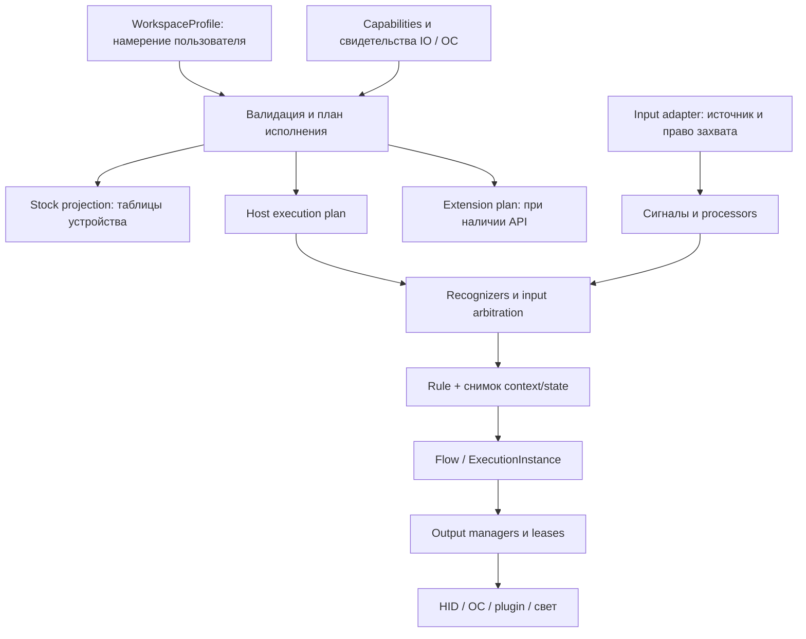

# Модель поведения клавиатуры

Дата: 2026-09-14. **Статус: проект архитектуры после проверки `objects.md`, не
реализованные DTO и не подтверждение полного исполнения на штатной IO.** Владелец
разрешил сложные жесты, слои и обработку в помощнике при надёжном поведении.
Исходный файл прочитан целиком; его хеш и покрытие — в
[свидетельстве](evidence/objects-architecture-review.json).

## Вывод до утверждения модели

Модель из файла подходит для приложения с несколькими исполнителями. **Весь этот
граф нельзя записать в IO White 1.17 через известный штатный протокол.** Устройство
принимает фиксированные таблицы назначений/RT/DKS/макросов/света, а не определения
произвольных recognizer, переменных, Flow и lifetime. Хранение профиля в приложении
не является записью всей его семантики в клавиатуру.

С разрешённым владельцем фоном это не требует урезать доменную модель. Но сегодня
нельзя обещать надёжное выполнение всех её сочетаний на stock: не приняты полный
analog, владение исходным вводом и смешанными удержаниями, временный RGB. Прямого
setter полосы нет. Подробное [покрытие всех 33 разделов](objects/COMPATIBILITY.md).

Предлагается сначала принять общую семантику и выполнить проверки границ ввода/
вывода. После них выбирается stock + helper либо узкое firmware-расширение.
Полная новая firmware не является условием проектирования; окончательная
применимость всех функций к IO пока остаётся открытой. [ADR-0009](adr/0009-behavior-model-and-execution.md).

## Что уточняется в исходной схеме

1. Не все перечисленные объекты — DDD entities. Измерение, условие и политика
   являются значениями; recognizer/processor — спецификацией и отдельным runtime.
   Стабильные ID нужны редактируемым определениям и экземплярам исполнения,
   но отдельная таблица/репозиторий на каждый термин не требуется.
2. Калибровка — также процедура с записью индивидуальных данных. Её нельзя исполнять
   как обычный шаг фильтра на каждом событии. Stock RT задаётся параметрами уже
   существующего обработчика; host RT над analog управляет только выходами helper.
3. Направленность порога устраняет повтор при обратном ходе, но **не исключает
   лёгкое действие при последующем глубоком нажатии**. Нужен общий recognizer с
   pending/commit и контроль исходного ввода.
4. `consumed` в событии движка и подавление ввода ОС — разные факты. Поле
   `consumeOriginal` является требованием плана исполнения, а не способом захвата.
5. Lease гарантирует владение внутри контролируемого выхода. Счётчик в Rust не
   обеспечивает сам по себе OR физического Shift и SendInput. Нужен подходящий
   выходной adapter и проверка смешанного ввода.
6. Входной SOCD-arbiter и RGB-compositor имеют общий принцип разрешения конфликтов,
   но разные типы и допустимые операции: `blend` неприменим к клавиатурным key-up.
7. Lifetime применим по контракту действия. Отмена удержания снимает lease;
   отмена Flow не отзывает отправленное письмо и не закрывает чужой документ.
   Завершение сетевой операции, очистка ресурса и компенсация — разные результаты.
8. «Любая комбинация сущностей» не означает любой исполнимый граф. Проверяются
   типы, циклы, бюджеты, доступность сигналов, место исполнения и ресурсы Target.

## Каталог объектов и границы хранения

Имена ниже целевые; существующие `ActionDefinition`/`GestureRule` сохраняются до
отдельной миграции. «Профиль» в колонке хранения — документ приложения, не flash IO.

| ID | Объект | Вид / ответственность | Хранение и штатное устройство |
|---|---|---|---|
| M01 | DeviceDescriptor / DeviceSession | Описание возможностей/топологии; отдельный экземпляр подключения | Descriptor + локальная привязка; session runtime. На IO не записывается |
| M02 | ControlDefinition | Entity: физическая клавиша или виртуальный control; стабильный ControlId | Профиль/топология. Stock принимает сопоставленный slot, не VirtualControl |
| M03 | SignalSample / InputEvent | Значение/событие: канал, единицы, качество, происхождение, время, sequence | Runtime; не постоянный журнал. Stock даёт только подтверждённые каналы |
| M04 | ProcessorSpec | Типизированное преобразование сигнала; runtime-состояние отдельно | Профиль; stock только известные параметры RT/хода/deadzone. CalibrationRequest отдельно |
| M05 | InteractionSpec / RecognizerInstance | Конфигурация автомата и его экземпляр на цикл/группу | Spec в Rule/Template, pending/таймеры в runtime. Stock только фиксированные аналоги |
| M06 | ConditionExpr | Value object: ограниченное дерево All/Any/Not/Predicate | Профиль; общего дерева условий в stock нет |
| M07 | StateDefinition / StateStore | Тип, область, default, persistence; текущее значение отдельно | Явно сохраняемые profile-переменные на ПК; session/execution не переживают запуск |
| M08 | RuleDefinition | Entity: источники, interaction, condition, ветви поведения, scope, policies | Профиль; в stock компилируются только выразимые целиком шаблоны |
| M09 | ActionType | Дескриптор операции, схема параметров/результата, допустимые target/lifetime | Registry встроенных/plugin операций; не запись в IO |
| M10 | ActionPreset | Entity: именованный настроенный экземпляр ActionType с вариантами ОС | Каталог приложения; собственные настройки, без состояния текущего выполнения |
| M11 | ActionCall | Value object: вызов preset или inline-операции с параметрами и TargetRef | Узел Flow; один примитивный эффект, не макрос в маске KeyDown |
| M12 | FlowDefinition | Aggregate: последовательность, ветвления, ожидание, повтор, вызов другого Flow | Библиотека; stock только допустимая линейная последовательность HID/delay |
| M13 | BehaviorTemplate | Aggregate библиотеки: переиспользуемый шаблон Rule/Interaction с параметрами | Профиль с зафиксированной версией. Повторное использование действий — FlowRef |
| M14 | TargetRef / LightingSurface | Типизированный выход: keyboard, mouse, analog, OS, plugin, свет | Конфигурация endpoint; клавиши и полоса — разные поверхности и карты |
| M15 | LayerDefinition | Entity профиля: overlay назначений, порядок, transparent/fallback | Host слои в RAM; stock только Main/Fn без обещания дополнительных таблиц |
| M16 | WorkspaceProfile | Aggregate: controls, rules, layers, ссылки на библиотеку и предпочтения исполнения | Версионированный документ ПК. Device projection и применённая версия отдельно |
| M17 | ScopeSpec | Value object: область существования/активации набора правил | Профиль; приложения/URL stock не знает |
| M18 | ContextSnapshot | Неизменяемый снимок внешнего/сессионного контекста с версией и свежестью | Runtime; запись `mute=true` не доказывает реальный mute приложения |
| M19 | InputArbitrationGroup | Entity конфигурации: участники, политика выбора, tie/release | Stock фиксированные RS/SOCD-пары; общие группы — helper/extension |
| M20 | OutputCompositionPolicy | Типизированная политика конфликтов/смешивания выходов | Профиль; renderer/helper runtime. Для stock эффектов общего compositor API нет |
| M21 | ExecutionInstance | Runtime entity: запуск Rule/Flow, parent, generation, cancel, результат | Только runtime; snapshot для debugger не возобновляет выполнение |
| M22 | OutputLease | Runtime entity: владелец, выход, значение/удержание, TTL, release | В менеджере конкретного выхода; штатного произвольного lease API IO нет |
| M23 | Lifetime / ExecutionPolicy | Value objects: завершение, retrigger, ожидание, конфликты | Профиль; stock только внутренние режимы поддержанных команд |
| M24 | TraceEvent | Диагностическое событие: input → решение → эффект, причина отказа | Ограниченный RAM-буфер, экспорт явно. Симуляция не является device trace |
| M25 | DeploymentPlan / CapabilityEvidence | Производный план исполнения и основания его допуска | План + manifest применения; не новая сущность, записываемая raw в IO |

`PhysicalKeyId`, `ControlId`, `DeviceSlot`, `LedAddress`, `HidUsage` не взаимозаменяемы.
`InvokeControl` создаёт внутреннее виртуальное событие; `KeyTap` отправляет выход и
по умолчанию обратно в engine не возвращается. У виртуального вызова есть root ID,
parent ID и `invocationDepth`; это не глубина хода. Циклы статически отклоняются,
динамические вызовы имеют предел глубины/числа операций и отмену.

Вызов логики физического Control не создаёт физическое измерение: origin остаётся
virtual, payload проходит проверку типа канала, а policies разрешают или отклоняют
такой вход. Для повторного использования без синтетических событий предпочтителен
FlowRef/BehaviorTemplate. Это позволяет вызвать логику другой клавиши, не подделывая
её датчик и не обходя `allowSynthetic`.

## Связи и размещение

Не все рёбра живут в одной ОС: A исполняется штатной firmware; B — helper; X —
проверенным расширением. Группа исключающих правил/общего ввода имеет **одного
владельца решения**, её нельзя произвольно разрезать на «лёгкое в stock, глубокое
в host». Внешний Flow может начинаться после принятого решения на устройстве.

Существующий модульный монолит сохраняется:

| Контекст | Что владеет |
|---|---|
| Device / Configuration | Identity, topology, raw snapshot, codec, безопасное применение stock |
| Behavior authoring | WorkspaceProfile, Rules, Templates, библиотека Actions/Flows |
| Execution planning | Проверка возможностей, размещение целой группы, бюджеты, причины отказа |
| Input runtime | Сигналы, processors, recognizers, input arbitration, состояния и таймеры |
| Action runtime | ExecutionInstance, Flow scheduler, выходные leases, adapters ОС/plugins |
| Lighting | Поверхности, compositor, ограниченный поток кадров, возврат базового света |
| Diagnostics | Трассы, simulator, фактические результаты и свидетельства |

DDD-core не зависит от Tauri/Win32/HID. Не обещается перенос всего host runtime в MCU:
переносим семантику и проверочные последовательности; firmware исполняет ограниченное
подмножество либо предоставляет транспорт. [План и миграция](../modules/execution-plan.md).

## Семантика, которая должна быть общей

- Измерение имеет тип канала: raw ADC, travel, firmware digital, virtual digital.
  Нельзя повторно применять к цифровому событию фильтр Hall или выдавать вычисленную
  скорость за измеренную. Направление называется `travelIncreasing/Decreasing`;
  `KeyDown/Up` — другой тип события. Неизвестное измерение не равно нулю.
- Recognizer имеет `Idle/Started/Performed/Ended/Canceled`, но одноразовый и
  удерживаемый варианты используют разные переходы. Started может дать preview;
  необратимый эффект не запускается до commit исключающего решения.
- Condition вычисляется на согласованном ContextSnapshot. Недоступный provider даёт
  `Unknown`, включая `Not(Unknown)`, а не разрешение действия. Политика различает
  проверку при запуске и поддержание условия во время lifetime.
- State имеет тип и область profile/session/execution. Persisted default и текущее
  значение разные; импорт не возобновляет toggle/held outputs. Изменения state
  сериализуются engine, сеть/скрипты не блокируют этот цикл.
- Flow — типизированное дерево управляющих узлов, Action — эффект. CallFlow — узел
  управления ссылающимся исполнением. Parallel/queue/restart имеют пределы, отмену,
  изоляцию instance variables и политику ошибок; общей транзакции внешних эффектов нет.
- Lifetime перечисляет доступные варианты для ActionType: удержание, timeout,
  until condition, source release, toggle, manual release, detached. Detached
  означает отдельного владельца исполнения, а не забытое нажатие без пути очистки.
- OutputLease освобождает только своё право. Модель OR допустима для множества
  контролируемых цифровых вкладов; физический ввод вне adapter в это множество
  автоматически не входит. RGB пользуется отдельным blend/priority compositor.

## Пользовательский контракт и сохранение

Основная форма остаётся «Когда → Только если → Сделать → До тех пор» с готовыми
шаблонами. Для взаимоисключающих ветвей UI показывает единый выбор, а не две
независимые строки. `consumeOriginal` показывается как доступное поведение только
при принятом маршруте. Отдельное место исполнения: **в клавиатуре / в помощнике**.

При применении видны три независимых результата: документ сохранён на ПК;
проекция записана/прочитана в устройстве; версия runtime активна. Кнопка «Сохранить»
не должна смешивать эти состояния. Без helper продолжают работать только аппаратные
назначения; неподдержанное или ожидающее приёмки не превращается в «применено».

Stock DKS импортируется в известный типизированный шаблон с исходными raw-полями.
Его представление универсальными правилами допускается только с подтверждённой
эквивалентностью фаз. Произвольное редактирование правил может вывести шаблон за
stock-возможности; форма объясняет это до записи. Не угадывать обратную свёртку.

Debugger различает данные устройства, события ОС, внутренние решения и симуляцию.
Состояния recognizer/lease внутри stock не наблюдаемы через известный API; можно
показать модель, но нельзя подписывать её как фактическое состояние MCU.

## Условия следующей реализации

Перед расширением общего UI принять input/output-контракт на PgUp/PgDn и совместных
модификаторах. До этого схема остаётся проектом с явными недоступными маршрутами.
Аналоговые жесты, свет клавиш и полоса проходят независимые проверки. Если stock
не удовлетворяет нужному контракту, добавляется adapter расширения из
[требований firmware](objects/FIRMWARE_CONTRACT.md), а не особые поля в каждом Rule.

Новые определения и profile v3 здесь не реализованы; текущий EXE остаётся прежним.

## Проверенные внешние основания

Это референсы семантики, не доказательства возможностей IO и не выбранные зависимости.

| Основание | Что используется в проекте |
|---|---|
| [Unity Interactions](https://docs.unity3d.com/Packages/com.unity.inputsystem@1.14/manual/Interactions.html) | Различение Started/Performed/Canceled и feedback до завершения; наш Ended описывается отдельно |
| [Wooting DKS](https://help.wooting.io/article/99-how-to-use-dks) | Разные этапы прямого/обратного хода и удержание между ними; байтовая совместимость IO из этого не следует |
| [Home Assistant scripts](https://www.home-assistant.io/docs/scripts/) | Композиция, ожидания и parallel с явной семантикой ошибок/переменных; на MCU этот язык не переносится |
| [Microsoft SendInput](https://learn.microsoft.com/en-us/windows/win32/api/winuser/nf-winuser-sendinput) | Существующие нажатия влияют на синтетический ввод; проверки текущего состояния недостаточно считать полным lease adapter |

Референс готовых input backends и условия их выбора — [Kanata в совместимости](objects/COMPATIBILITY.md).
